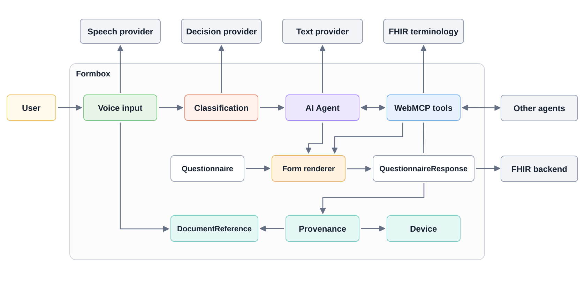

# How AI Scriber works

AI Scriber runs an agent loop in the form renderer's browser tab. Speech recognition produces text, the agent interprets it with the current form state, and WebMCP tools apply changes through the renderer's existing widgets and events. Responses use the normal Formbox saving and submission flows.

This page explains that browser implementation. For setup and the visible controls, see [AI Scriber](ai-scriber.md).

Speech and text models depend on your provider settings. Classification is optional.

The **Questionnaire** defines the form's fields and rules. The **QuestionnaireResponse** holds the answers and their evidence.

## From speech to an instruction

The browser captures microphone audio and streams it to the selected speech provider over a WebSocket. Interim transcripts update the bubble beside the Scriber cursor. A finalized transcript becomes an instruction with a source identifier, timestamp, model identity, and the Scriber system prompt.

When an instruction arrives while the agent is working, optional **Jev classification through OpenRouter** chooses how to queue it:

* **Steering** revises, retracts, clarifies, or prioritizes existing work.
* **Follow-up** adds independent work to handle after the current task.

Mixed or uncertain classifications use steering. Follow-up requires at least 0.9 confidence; classification failure or timeout falls back to steering. Without classification configured, new instructions use steering. The visible count includes queued and active instructions until the agent finishes handling them.

## The AI Agent loop

The **AI Agent** manages the conversation and tool execution loop. The application supplies the system prompt, input messages, and renderer tools. Before each model request, it adds a fresh renderer observation so the model sees current fields, controls, notes, and the form outline. That observation is application context, separate from the user's source testimony.

The model can return tool calls, inspect their results, and take further actions. Tools execute sequentially. Independent answers on the current page can be written in one batch; changing a controlling answer can require another read before filling newly available fields.

The prompt directs the Scriber to use supplied or confirmed facts, preserve unrelated answers, request clarification through field notes, and submit only when explicitly asked. It finishes with an empty response. Visible feedback comes from the renderer, cursor, transcript, notes, and errors rather than assistant narration. These prompt instructions guide the model; the tool checks below enforce specific write constraints.

## Renderer tools

The renderer registers seven tools through **WebMCP**, using **MCP-B** for browser integration. The built-in Scriber discovers and calls tools owned by its renderer document. Other browser agents can use the same registered capabilities when connected through the browser's WebMCP integration.

| Tool | Purpose and completion behavior |
| --- | --- |
| `getRendererState` | Read the outline, notes, and current fields and controls; inspect an element; or discover package navigation. Returned `next` cursors page through longer results. |
| `setRendererAnswers` | Set editable answers on the current page. Omitted fields are preserved; `null` clears an answer. Invalid input rejects the requested batch before writing it. |
| `clickRenderer` | Activate a returned control. A pager control accepts a one-based destination `page`; navigation returns state after the destination loads. |
| `validateRenderer` | Validate the open form and return its title and field issues without submitting it. Navigate before validating another form. |
| `submitRenderer` | Validate and submit the response, returning the submission result. Embedded controlled renderers can report completion to the host; `persist: true` requests server persistence. Package flows use their visible navigation controls. |
| `searchRendererCodes` | Search the ValueSet bound to a current terminology field and return Coding candidates. It leaves answers unchanged. |
| `setRendererNotes` | Set, replace, or clear field notes. Note changes are immediate and silent; `null` clears a note. |

Field and control IDs come from current observations. They can expire when items are removed or a response is replaced, so agents must refresh stale state. Tool results expose success, invalid input, or errors through the same call, without a separate operation polling tool.

An answer write completes after its local widget events have applied. Autosave and asynchronous expressions continue independently; later reads and validation reflect their results. A successful write therefore does not establish that the whole response is valid or saved. Submission waits for its own completion. See [Embedding](aidbox-ui-builder-alpha/embedding.md) for host-controlled response handling.

The `form.enable-scriber` configuration flag controls visibility of the built-in Scriber controls. It does not control registration or access to the WebMCP tools.

## Terminology lookup

`searchRendererCodes` searches the current field's configured terminology server with one to three equivalent clinical terms. It retains the field's ValueSet version and binding parameters. Results include Coding values, designations, and the queries that matched them; retrieval order is not a measure of clinical certainty.

Before writing a terminology answer, the renderer checks that the Coding was returned by a search for that field and binding. Candidates expire after five minutes or a binding change. The model must copy the selected Coding unchanged and support the answer with the user's words. A search result establishes the code's origin, while selecting the clinically appropriate concept remains the model's task. No match means the search found no candidate for those terms, not that the patient has no condition.

See [Integration with external terminology servers](aidbox-ui-builder-alpha/integration-with-external-terminology-servers.md) for server configuration.

## Answer evidence

For each answer, correction, or explicit clear made from spoken input, the Scriber supplies a source ID and an exact supporting quote. Before writing the batch, the renderer checks that each quote occurs exactly once in its registered source. The application creates the source record; the model selects a passage from it.

The response carries the evidence in `QuestionnaireResponse.contained`:

| Record | What it represents |
| --- | --- |
| **DocumentReference** | A finalized transcript segment, or the system prompt used for the update. Transcript text is stored as a base64-encoded `text/plain` attachment. |
| **Device** | The text model and provider responsible for the update. |
| **Provenance** | The target answer elements, the model as author, and source document references. |

Answer elements use the [derivation-reference extension](https://hl7.org/fhir/extensions/StructureDefinition-derivation-reference.html) to point to a transcript DocumentReference and record the supporting passage's character offset and length. Provenance targets use [targetElement](https://hl7.org/fhir/extensions/StructureDefinition-targetElement.html) to identify answer elements by their IDs. Responses carrying current AI answer annotations are marked **AI asserted** (`AIAST`).

Evidence stays associated with answers across repeated rows and package navigation. When a manual edit changes an annotated value, its old annotation no longer applies. Agent notes are separate, session-only UI state and are not FHIR evidence records.

A valid source quote confirms that the text exists. It does not prove the model interpreted it correctly, and form validation checks the response's rules rather than the truth of the supplied facts.

## Data and storage

The browser coordinates the loop and holds the active conversation, queues, and notes. Configured providers receive the data needed for their work:

* The **speech provider** receives microphone audio.
* The **text provider** receives the system prompt, conversation history, current form observations, and tool results, which can include existing answers.
* **OpenRouter**, when classification is configured and needed during active work, receives the new instruction and relevant recent instructions, queued work, and labels of updates underway.
* The **terminology server** receives search terms and the field's binding parameters.

AI provider settings, including keys, are stored under `ai-config` in browser local storage for the site's origin. The Builder and other Formbox AI interfaces share those settings. They are separate from the server's `SDCConfig` resource.

QuestionnaireResponse data and its contained evidence follow the renderer's normal persistence flow. Embedded applications can own saving through their callbacks. **Mute** pauses microphone input while the current loop can continue; **Stop** cancels listening, classification, and agent execution and clears queued instructions. Already applied answers remain.
