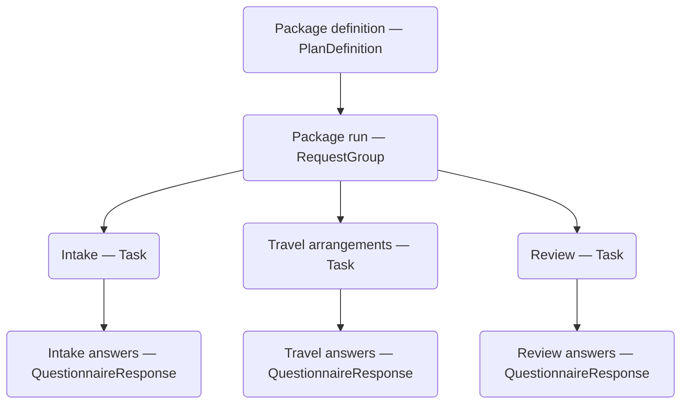

# Form packages

A **form package** combines several questionnaires into one workflow. You choose their order, decide which forms are enabled, and copy answers between forms. The person completing the package follows one link and submits the enabled forms together.

Use a package when questionnaires need to remain reusable while participating in a shared workflow. For example, an intake package can contain:

| Order | Form | When it appears | Prefill |
| --- | --- | --- | --- |
| 1 | Intake | Always | None |
| 2 | Travel arrangements | When the intake answer says travel assistance is needed | The name entered in Intake |
| 3 | Review | Always | None |

If travel assistance is not needed, the person goes from Intake directly to Review. Each included questionnaire still has its own response.

Create a package in the [Package Designer](package-designer.md), or define and run it through the [Form packages API](reference/form-packages-api.md). Both use the same package definition and rules.

## Availability

Packages are available in both [standalone Formbox](getting-started-formbox.md) and Formbox running as an [Aidbox module](getting-started.md).

Packages use local storage by default and also support a configured [external FHIR data store](aidbox-ui-builder-alpha/external-fhir-servers-as-a-data-backend.md#package-storage-requirements).

## Definition and instance

A package has a reusable definition and a separate instance for each run.

| Resource | Purpose |
| --- | --- |
| `Questionnaire` | Defines the questions in an individual form. |
| `PlanDefinition` | Defines the package: its ordered forms, enable-when conditions, and prefill rules. Each form is an action with its own ID. |
| `RequestGroup` | Represents one package run and its overall status. |
| `Task` | Tracks one form within that run and links its questionnaire to its response. |
| `QuestionnaireResponse` | Stores the answers to one form in the package. |

Starting a package creates its `RequestGroup` and tasks. A response is created when its form first opens. Starting the same definition again creates an independent run.

An **action ID** identifies a form's place in the package. It is separate from the questionnaire's resource ID. For example, an action named `intake` exposes its answers to package rules as `%intake`.

## Order and enable-when rules

The definition's action order is the presentation order. The Designer shows every form on one vertical track, including conditional forms. The renderer walks through the forms that are currently enabled in that order.

A form without an enable-when condition is always enabled. A conditional form is enabled when its condition evaluates to `true`. An empty result is treated as false. Multiple conditions on the same action must all be true; use an OR group or an `or` expression for alternatives.

Conditions can inspect answers to a particular question or whether another form has any answers. They can also combine several inputs with AND and OR. See [editing enable-when rules](package-designer.md#enable-when).

Package expressions have access to every action's saved response, regardless of its position. An unopened form has no response yet. Put source forms before the forms that depend on their answers, and test each branch in Preview.

## Prefilling a form

A prefill rule identifies a target question in the form being opened and an expression that supplies its answer. In the example, Travel arrangements copies the name from Intake.

On the first opening of a form, Formbox performs the questionnaire's ordinary [population](aidbox-ui-builder-alpha/form-creation/population.md), then applies package prefills. Prefills can use several source answers in an advanced FHIRPath expression.

Prefills initialize a response once. Going back, changing an earlier answer, and reopening an existing response preserves that response's answers; it does not run the prefills again.

## Completing a package

The renderer saves answers as drafts and refreshes which forms are enabled. **Next** validates the form being left. **Back** lets the person revisit earlier enabled forms. The sidebar shows progress through the package; the active questionnaire's outline provides navigation within that form.

**Submit** validates all enabled forms and runs their configured [data extraction](aidbox-ui-builder-alpha/form-creation/data-extraction.md). It sends the package status, tasks, completed responses, and extraction writes in one transaction bundle. Validation and extraction run before this bundle is written. The configured data store commits or rejects this bundle as a unit. Later failures do not undo a committed bundle.

An enabled form must be opened before submission, even if all its questions are optional. Draft responses for forms excluded by the final conditions are discarded when the package is submitted. Until then, saved answers remain available to package expressions even if their form becomes disabled.

## Reviewing and amending responses

In **Responses**, expand a package row to inspect its individual responses, or open the package title to review the complete run.

When amendments are enabled, **Amend** starts an editing session. Changes can enable additional forms. The previous submission remains stored until the amended package is successfully submitted. Existing submitted responses become `amended`, newly included responses become `completed`, and earlier versions remain in response history.

## Sharing and embedding

Use **Share** to create a link to a new package run, or **Send** to deliver it through the [email workflow](aidbox-ui-builder-alpha/form-sending.md#sending-a-package). Each recipient should have their own run. Reissuing a link for an existing run continues that same package.

Integrations can [embed the renderer web component](aidbox-ui-builder-alpha/embedding.md#embedding-a-package) with a package run ID, or [generate a package link](reference/form-packages-api.md#create-a-run-and-link) and use it as an iframe source. The package renderer handles ordering, conditions, drafts, and submission.

## Updating a definition

Give published packages and their questionnaires a canonical URL and version. A run references those definitions by canonical URL and, when supplied, version. These references are not copies of the definitions: changing a referenced resource in place can affect existing runs.

To preserve an existing version, create a new resource with a new version. The Designer offers **Create New** when the canonical URL or version of an active package changes. See [saving a package](package-designer.md#save-the-package) and the [API definition rules](reference/form-packages-api.md#package-definition).
