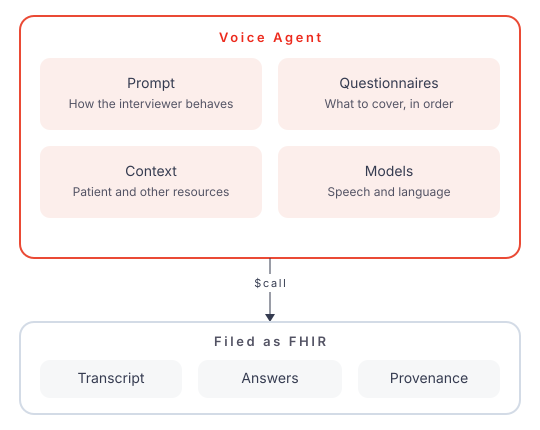

# Voice Agents

A **Voice Agent** in Formbox is a reusable configuration for an automated phone interview. You choose the FHIR `Questionnaire`s it should cover, write how the interviewer should behave, declare the **context** it needs (the Patient, and any other FHIR resources), and pick the speech and language models. When it runs, it phones the patient, talks through those questionnaires, and files what was said as FHIR data: a transcript, a `QuestionnaireResponse` per questionnaire, and a `Provenance` that a model — not a clinician — wrote the answers.

Without it, those questionnaires need either the patient to fill a form or a human to sit on the call.

The conversation is not a script and not a phone tree. The model is given the questionnaires and the patient context, and decides how to ask. There is no fixed first line: it writes its own greeting so it can use what the context told it.

The Formbox **Voice Agents** UI is where you design an agent and test it by typing or talking to it. **`$call` is how an integration runs it in production.**

## The agent



The configuration is an `SDCVoiceAgent`, and the wording it speaks is a versioned `SDCVoicePrompt` — a call always resolves the prompt's active revision, so editing it does not require touching the agent.

Two rules decide whether a call can be placed at all:

* every context slot the agent declares must be supplied to `$call`
* a phone call needs a slot of type `Patient` — that is who gets dialled

Build the agent in the [designer](#design-and-test-an-agent), or with plain FHIR CRUD — see [resource examples](reference/voice-agents-api.md#resources).

## How a call works

1. `$call` creates a `Task` and Twilio dials the patient (or `send-at` schedules the dial).
2. Aidbox builds a system prompt from three layers: the agent's instruction text (the active `SDCVoicePrompt` revision), the resolved context resources, and the questionnaires rendered as questions. A hang-up instruction is appended so the model can end the call.
3. Speech-to-text turns the patient's audio into text; the conversation model replies; text-to-speech speaks that reply. The model never hears raw audio.
4. When every question is covered, or the person does not want to go on, the model says goodbye and hangs up.
5. After the socket closes, a **separate extractor model** reads the transcript into `QuestionnaireResponse`s. That is deliberate: a small talk model cannot reliably tell "I'd rather not say" from "no". If the agent sets no `extractorLlm`, a default extractor is used.

When nobody picks up, the phone workflow redials up to `maxAttempts`. `$hangup` ends a live call from the outside. A test run never dials and never retries.

## Place a call — `$call`

```
POST /sdc/voice/$call
```

```yaml
POST /sdc/voice/$call
content-type: text/yaml
accept: text/yaml

resourceType: Parameters
parameter:
- name: transport
  valueString: phone
- name: agent
  valueReference:
    reference: SDCVoiceAgent/abc
- name: to
  valueString: '+15551234567'
- name: context
  part:
  - name: name
    valueString: patient
  - name: content
    valueReference:
      reference: Patient/123
```

`to` is optional: if omitted, Aidbox uses the patient's first `telecom` of system `phone`. `send-at` (an ISO-8601 instant) schedules the dial instead of dialling now.

Example response:

```yaml
resourceType: Parameters
parameter:
- name: task
  valueReference:
    reference: Task/def
- name: status
  valueString: requested
- name: call-id
  valueString: 0c1a2b3c-4d5e-6f70-8899-aabbccddeeff
```

End a live call with `POST /sdc/voice/$hangup`. Extraction runs in the background after hangup — see below.

`transport: browser` is what the tester uses: it opens a websocket for the tab instead of dialling. Passing `to` or `send-at` with it is refused.

## What a call leaves behind

The `Task` from `$call` owns the whole run. After the conversation ends, extraction writes FHIR resources and hangs them off `Task.output`:

| `Task.output` type | Resource | What it is |
| --- | --- | --- |
| `transcript` | `DocumentReference` | Plain-text transcript |
| `questionnaire-response` | `QuestionnaireResponse` | One per questionnaire that has answerable items |
| `provenance` | `Provenance` | The extractor `Device` derived those answers from that transcript |
| `extracted` | Observations and the like | What SDC `$extract` made of a **completed** response |

A questionnaire of nothing but display items is skipped. One Provenance covers every response from the same pass.

Every answer carries what backs it: the words it was read from, the turn they were said in, whether the person stated or implied it, and the model's confidence. Unanswered questions stay in the response and say why they are empty. See [answers and their evidence](reference/voice-agents-api.md#answers-and-their-evidence).

The audit trail follows the HL7 [AI Transparency on FHIR](https://build.fhir.org/ig/HL7/aitransparency-ig/) IG: the model is a `Device`, the `Provenance` marks the answers as AI-asserted and names that model as their author. The IG is still in ballot, so its codes may change.

`QuestionnaireResponse.status` is `completed` when every answerable item has an answer, otherwise `in-progress`. Completed responses go through `$submit` (validation and SDC extraction). Partial ones are stored as they are, so a call that ended early does not look like a finished form.

A conversation that produced no answers still gets `Task.output`, so someone who picked up but answered nothing is not redialled as if they had never answered.

Read it back with `GET /sdc/voice/run/{call-id}` or by following `Task.output`. Neither waits: extraction runs after the call ends, so poll if you ask straight after hangup.

## Configure providers

Keys are judged per agent. A provider with no key simply contributes no models.

| Provider | Used for | Environment variable |
| --- | --- | --- |
| OpenAI (or any OpenAI-compatible host) | LLM | `BOX_MODULE_SDC_OPENAI_API_KEY`, optional `BOX_MODULE_SDC_OPENAI_BASE_URL` |
| Gemini | LLM | `BOX_SDC_GEMINI_API_KEY` |
| Deepgram | STT, TTS | `BOX_MODULE_SDC_DEEPGRAM_API_KEY` |
| Cartesia | STT, TTS | `BOX_MODULE_SDC_CARTESIA_API_KEY` |
| ElevenLabs | TTS | `BOX_MODULE_SDC_ELEVENLABS_API_KEY` |
| Twilio | Phone | `BOX_MODULE_SDC_TWILIO_ACCOUNT_SID`, `BOX_MODULE_SDC_TWILIO_AUTH_TOKEN`, `BOX_MODULE_SDC_TWILIO_FROM_NUMBER` |

Most `BOX_MODULE_SDC_*` keys also accept `BOX_SDC_*`. Gemini is only `BOX_SDC_GEMINI_API_KEY`.

`$call` (phone) needs the LLM, STT and TTS keys for the agent's models, plus Twilio. Testing an agent by typing needs the LLM key only.

Deepgram STT is limited to Flux (`flux-general-en`). Cartesia STT is limited to `ink-2`.

## Design and test an agent

Open **Voice Agents** in the Formbox sidebar (`/ui/sdc/voice-agents`). This is the designer: it writes the same `SDCVoiceAgent` and `SDCVoicePrompt` resources an integration would create itself.

Design, in the editor tabs:

* **Prompt** — pick or create an `SDCVoicePrompt` lineage and edit its text. Save as a new version or replace the current one; calls resolve the latest active revision.
* **Questionnaires** — search and tick. Order is interview order.
* **Context** — declare the slots the agent needs (`name`, resource type, optional label).
* **Voice** — choose the conversation model, speech-to-text, voice, and the extraction model. Providers with no key show `No API key set`.

Test, from the right-hand panel:

* **Text** — type at the agent. No speech provider is opened, so it costs only LLM tokens. Fastest way to iterate on wording.
* **Browser call** — talk to it through your microphone.
* **Phone call** — a real call, so it asks for confirmation first.

Every declared context slot must be filled before a test run starts, exactly as for a real call. Test runs are extracted too: a `Task` (`voice-rehearsal`), a transcript and answers are written, which is how the extraction prompt gets debugged against real resources.

Testing an unsaved draft writes no `SDCVoiceAgent` and no `Device` — the draft is kept inside the Task instead.

**Test settings** lets you supply your own provider keys for test runs. They stay in the browser and never reach a resource, the settings, or the logs. Phone calls always use the deployment keys.
